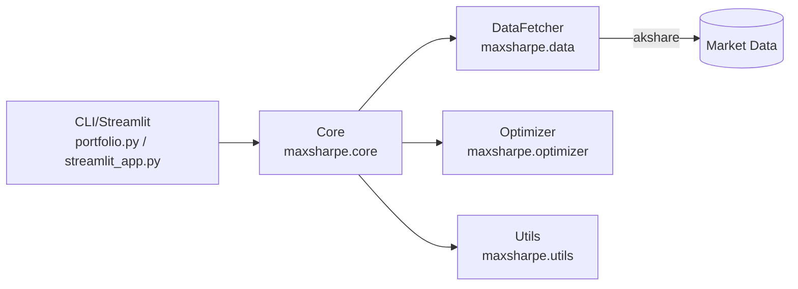

# Max Sharpe Portfolio Optimizer 📈

[](https://www.python.org/)
[](https://opensource.org/licenses/MIT)
[](https://github.com/psf/black)
[](http://makeapullrequest.com)
[](https://github.com/henrywen98/investment_portfolio_optimizer/actions/workflows/ci.yml)

[English README](README_EN.md) | 中文说明

一个用于下载股票收盘价并构建“最大夏普比率”投资组合的 Python 工具（当前仅支持中国 A 股）。

> ⚠️ 声明：本项目仅用于教育与研究，不构成任何投资建议。

## ✨ 特性

- 📅 智能对齐交易日：自动匹配上交所（XSHG）交易日区间
- 📊 数据来源：使用 akshare 获取 A 股后复权收盘价
- 🎯 组合优化：基于 PyPortfolioOpt 计算最大夏普比率，支持单资产权重上限
- 📁 结果导出：输出价格数据、权重配置、表现指标（CSV/JSON）
- 🧰 友好接口：提供 CLI 与 Python API 两种使用方式
- 🧹 数据校验：自动清洗与校验缺失值、非法值

## 🚀 快速开始

### 环境要求

- Python 3.8+
- 已安装 pip 或 conda

### 安装

```bash
git clone https://github.com/henrywen98/investment_portfolio_optimizer.git
cd investment_portfolio_optimizer
python -m venv .venv && source .venv/bin/activate  # Windows: .venv\Scripts\activate
pip install -r requirements.txt
pip install -e .  # 可选：安装 CLI 入口 maxsharpe
```

### 命令行使用

获取默认 A 股标的，回溯近 5 年，最大单资产权重 25%，输出到 `./data`：

```bash
python portfolio.py \
  --market CN \
  --years 5 \
  --rf 0.01696 \
  --max-weight 0.25 \
  --output ./data
```

若使用可执行入口（需先 `pip install -e .`）：

```bash
maxsharpe --market CN --years 5 --rf 0.01696 --max-weight 0.25 --output ./data
```

自定义标的（以 3 只股票为例）：

```bash
python portfolio.py --market CN --tickers "600519,000858,601318" --years 3
```

### Python API 使用

```python
from maxsharpe.core import PortfolioOptimizer

optimizer = PortfolioOptimizer(market="CN", risk_free_rate=0.02, max_weight=0.25)
weights, performance = optimizer.optimize_portfolio(
    tickers=["600519", "000858", "601318"],
    years=3,
)

print("Weights:", weights)
print("Performance:", performance)  # 包含 expected_annual_return / annual_volatility / sharpe_ratio 等
```

### Streamlit 界面

```bash
streamlit run streamlit_app.py
```

### Docker 运行（可选）

```bash
docker build -t maxsharpe:latest .
docker run --rm -v "$PWD/data:/app/data" maxsharpe:latest python portfolio.py --market CN --years 5 --output /app/data
```

## ⚙️ 命令行参数

| 参数 | 描述 | 默认值 | 示例 |
|------|------|--------|------|
| `--market` | 市场（仅支持 `CN`） | `CN` | `--market CN` |
| `--tickers` | 自定义股票列表（逗号分隔） | 使用默认股票池 | `--tickers "600519,000858"` |
| `--years` | 回溯年数（与 `--start-date/--end-date` 互斥） | `5` | `--years 3` |
| `--start-date` | 开始日期（YYYY-MM-DD） | 自动计算 | `--start-date 2020-01-01` |
| `--end-date` | 结束日期（YYYY-MM-DD） | 今天 | `--end-date 2023-12-31` |
| `--rf` | 无风险利率（年化） | `0.02` | `--rf 0.015` |
| `--max-weight` | 单一资产最大权重上限 | `1.0` | `--max-weight 0.3` |
| `--output` | 输出目录 | `./data` | `--output /path/to/output` |
| `--quiet` | 减少日志输出 | `False` | `--quiet` |

## 📁 输出文件说明

运行完成后，会在 `--output` 目录生成：

| 文件 | 文件名格式 | 内容 |
|------|------------|------|
| 价格数据 | `stock_data_<start>_<end>.csv` | 所有股票的历史收盘价（对齐后） |
| 权重配置 | `weights_<start>_<end>.csv` | 最大夏普比率组合的权重分配（非零权重） |
| 表现指标 | `performance_<start>_<end>.json` | 年化收益、波动率、夏普比率、最大回撤等 |

## 📈 默认股票池（CN）

精选 25 只主流 A 股（示例片段）：

- 消费：贵州茅台(600519)、五粮液(000858)
- 金融：中国平安(601318)、招商银行(600036)
- 科技：中兴通讯(000063)、科大讯飞(002230)
- 能源：中国石化(600028)、中国石油(601857)

## 🧩 技术要点

- 数据源：使用 [akshare](https://akshare.akfamily.xyz/) 获取 A 股数据（支持前/后复权）
- 交易日：基于上交所 (XSHG) 日历对齐（pandas-market-calendars）
- 优化器：使用 PyPortfolioOpt 计算最大夏普比率，可设置单资产权重上限

### 架构示意



## ❓常见问题（FAQ）

- ImportError: 未安装依赖
  - 安装 `akshare`、`pandas-market-calendars`、`PyPortfolioOpt`：`pip install -r requirements.txt`
- 获取到的价格数据为空或很少
  - 检查股票代码是否正确；延长时间窗口；更换标的尝试
- “未找到有效的交易日”
  - 检查日期范围是否包含交易日；程序会自动对齐到最近的有效交易日

## 🤝 贡献

欢迎 PR！请查看 [CONTRIBUTING.md](CONTRIBUTING.md) 了解开发流程与规范。

### 本地开发速查（可选）

```bash
pip install -r requirements.txt
pip install -e .[dev]
black . && isort . && flake8 .
pytest -q
```

## 📄 许可证

MIT License，详情见 [LICENSE](LICENSE)。

## 📬 支持

- 问题与建议：提 Issue 到本仓库
- 如果本项目对你有帮助，欢迎点个 Star ⭐

### 示例

更多示例见 `examples/`：

```bash
python examples/basic_usage.py
python examples/custom_portfolio.py --tickers 600519,000858,601318 --years 3 --rf 0.02 --max-weight 0.25
python examples/visualization.py --tickers 600519,000858,601318 --years 3
```
