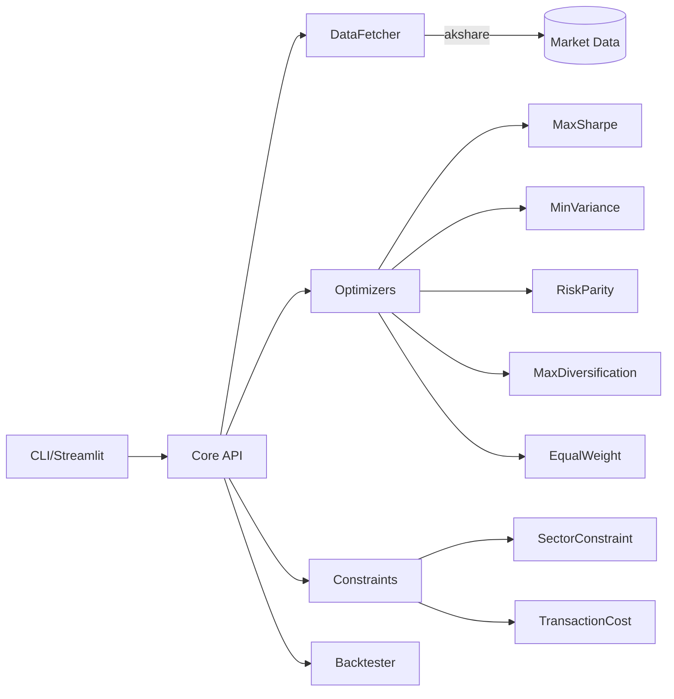

# 投资组合优化器 v2.0 📈

[](https://www.python.org/)
[](https://opensource.org/licenses/MIT)
[](https://github.com/psf/black)
[](http://makeapullrequest.com)
[](https://github.com/henrywen98/investment_portfolio_optimizer/actions/workflows/ci.yml)

[English README](README_EN.md) | 中文说明

一个功能完善的投资组合优化工具，支持**多种优化策略**、**回测分析**、**行业约束**和**交易成本计算**（当前仅支持中国 A 股）。

> ⚠️ 声明：本项目仅用于教育与研究，不构成任何投资建议。

## ✨ 核心特性

### 🎯 多种优化策略
- **最大夏普比率** (Max Sharpe) - 风险调整收益最大化
- **最小方差** (Min Variance) - 波动率最小化
- **风险平价** (Risk Parity) - 风险贡献均等化
- **最大分散化** (Max Diversification) - 分散化程度最大化
- **等权重** (Equal Weight) - 简单均分配置

### 📊 专业风险指标
- 夏普比率 / Sortino比率 / Calmar比率
- VaR (风险价值) / CVaR (条件风险价值)
- 最大回撤
- 投资组合集中度 (HHI指数)

### 🔄 回测功能
- 滚动窗口回测
- 定期再平衡
- 交易成本计算
- 策略对比分析

### 🏭 行业约束
- 单一行业权重上限
- 行业分散度要求
- 申万一级行业分类

### 💰 交易成本
- 佣金计算
- 印花税计算
- 滑点估算

## 🚀 快速开始

### 环境要求

- Python 3.8+
- 已安装 pip 或 conda

### 安装

```bash
git clone https://github.com/henrywen98/investment_portfolio_optimizer.git
cd investment_portfolio_optimizer
python -m venv .venv && source .venv/bin/activate  # Windows: .venv\Scripts\activate
pip install -r requirements.txt
pip install -e .  # 可选：安装 CLI 入口 maxsharpe
```

### 命令行使用

基础使用（最大夏普比率策略）：

```bash
python portfolio.py --market CN --years 5 --rf 0.02 --max-weight 0.25
```

使用不同策略：

```bash
# 最小方差策略
python portfolio.py --strategy min_variance --years 3

# 风险平价策略
python portfolio.py --strategy risk_parity --max-weight 0.3

# 策略对比
python portfolio.py --compare --years 3
```

自定义股票池：

```bash
python portfolio.py --tickers "600519,000858,601318,600036,000333" --years 3 --strategy max_sharpe
```

### Python API 使用

#### 基础用法

```python
from maxsharpe import PortfolioOptimizer

# 创建优化器（可选择不同策略）
optimizer = PortfolioOptimizer(
    market="CN",
    risk_free_rate=0.02,
    max_weight=0.25,
    strategy="max_sharpe"  # 或 "min_variance", "risk_parity", "max_diversification", "equal_weight"
)

# 执行优化
weights, performance = optimizer.optimize_portfolio(
    tickers=["600519", "000858", "601318", "600036", "000333"],
    years=3,
)

print("权重:", weights)
print("夏普比率:", performance['sharpe_ratio'])
print("最大回撤:", performance['max_drawdown'])
```

#### 策略对比

```python
from maxsharpe import PortfolioOptimizer

optimizer = PortfolioOptimizer()
results = optimizer.compare_strategies(
    tickers=["600519", "000858", "601318", "600036", "000333"],
    years=3
)

for strategy, (weights, perf) in results.items():
    print(f"{strategy}: 夏普={perf['sharpe_ratio']:.3f}, 波动率={perf['annual_volatility']:.2%}")
```

#### 带行业约束的优化

```python
from maxsharpe import PortfolioOptimizer

optimizer = PortfolioOptimizer(strategy="max_sharpe", max_weight=0.3)

# 设置行业约束：单一行业不超过30%，至少覆盖3个行业
optimizer.set_sector_constraint(max_sector_weight=0.3, min_sectors=3)

weights, performance = optimizer.optimize_portfolio(years=3)
print("行业分布:", performance.get('sector_weights'))
```

#### 回测分析

```python
from maxsharpe import Backtester, BacktestConfig, OptimizationStrategy

# 配置回测参数
config = BacktestConfig(
    lookback_days=252,       # 优化窗口：1年
    rebalance_frequency=63,  # 再平衡周期：约3个月
    strategy=OptimizationStrategy.MAX_SHARPE,
    commission_rate=0.0003,  # 佣金率
    stamp_duty=0.001,        # 印花税
    initial_capital=1_000_000
)

# 创建回测器
backtester = Backtester(config)

# 运行回测（需要提供价格数据）
result = backtester.run(prices_dataframe)

print(f"年化收益: {result.metrics['annual_return']:.2%}")
print(f"夏普比率: {result.metrics['sharpe_ratio']:.2f}")
print(f"最大回撤: {result.metrics['max_drawdown']:.2%}")
print(f"总交易成本: {result.metrics['total_trading_cost']:.2f}")
```

### Streamlit 界面

```bash
streamlit run streamlit_app.py
```

全新的 Web 界面支持：
- 多策略选择与对比
- 实时参数调整
- 权重分布可视化
- 行业分析图表
- 性能指标仪表板

### Docker 运行

```bash
docker build -t portfolio-optimizer:latest .
docker run --rm -v "$PWD/data:/app/data" portfolio-optimizer:latest \
  python portfolio.py --strategy risk_parity --years 3 --output /app/data
```

## ⚙️ 命令行参数

| 参数 | 描述 | 默认值 | 示例 |
|------|------|--------|------|
| `--market` | 市场（仅支持 `CN`） | `CN` | `--market CN` |
| `--strategy` | 优化策略 | `max_sharpe` | `--strategy min_variance` |
| `--tickers` | 自定义股票列表（逗号分隔） | 使用默认股票池 | `--tickers "600519,000858"` |
| `--years` | 回溯年数 | `5` | `--years 3` |
| `--start-date` | 开始日期（YYYY-MM-DD） | 自动计算 | `--start-date 2020-01-01` |
| `--end-date` | 结束日期（YYYY-MM-DD） | 今天 | `--end-date 2023-12-31` |
| `--rf` | 无风险利率（年化） | `0.02` | `--rf 0.015` |
| `--max-weight` | 单一资产最大权重上限 | `0.25` | `--max-weight 0.3` |
| `--min-weight` | 单一资产最小权重下限 | `0.0` | `--min-weight 0.05` |
| `--compare` | 对比所有策略 | `False` | `--compare` |
| `--output` | 输出目录 | `./data` | `--output /path/to/output` |
| `--quiet` | 减少日志输出 | `False` | `--quiet` |

### 可用策略

| 策略名称 | 说明 | 适用场景 |
|----------|------|----------|
| `max_sharpe` | 最大夏普比率 | 追求风险调整收益最优 |
| `min_variance` | 最小方差 | 厌恶风险，追求稳定 |
| `risk_parity` | 风险平价 | 平衡各资产风险贡献 |
| `max_diversification` | 最大分散化 | 追求投资多元化 |
| `equal_weight` | 等权重 | 简单透明的基准策略 |

## 📁 输出文件说明

| 文件 | 文件名格式 | 内容 |
|------|------------|------|
| 价格数据 | `stock_data_<start>_<end>.csv` | 所有股票的历史收盘价 |
| 权重配置 | `weights_<start>_<end>.csv` | 优化后的权重分配 |
| 表现指标 | `performance_<start>_<end>.json` | 完整性能指标 |

### 性能指标详解

```json
{
  "annual": {
    "expected_return": 0.15,
    "volatility": 0.20,
    "sharpe": 0.65,
    "sortino": 0.85,
    "calmar": 0.45,
    "max_drawdown": -0.33
  },
  "risk": {
    "var_5_percent": -0.02,
    "var_1_percent": -0.03,
    "cvar_5_percent": -0.025
  }
}
```

## 🧩 技术架构



### 模块说明

| 模块 | 路径 | 功能 |
|------|------|------|
| Core | `maxsharpe/core.py` | 主要API和工作流程 |
| Optimizer | `maxsharpe/optimizer.py` | 5种优化策略实现 |
| Data | `maxsharpe/data.py` | 数据获取 |
| Constraints | `maxsharpe/constraints.py` | 行业约束和交易成本 |
| Backtest | `maxsharpe/backtest.py` | 回测引擎 |
| Utils | `maxsharpe/utils.py` | 工具函数 |

## ❓常见问题（FAQ）

**Q: 如何选择合适的策略？**
- 追求高收益：`max_sharpe`
- 厌恶风险：`min_variance`
- 长期持有：`risk_parity`
- 不确定时：使用 `--compare` 对比所有策略

**Q: 回测结果可靠吗？**
- 回测考虑了交易成本和滑点
- 请注意过去表现不代表未来收益
- 建议结合多种策略对比分析

**Q: 如何添加新的股票？**
- 使用 `--tickers` 参数指定
- 或修改 `maxsharpe/data.py` 中的 `DEFAULT_TICKERS_CN`

## 🤝 贡献

欢迎 PR！请查看 [CONTRIBUTING.md](CONTRIBUTING.md) 了解开发流程与规范。

```bash
# 本地开发
pip install -r requirements.txt
pip install -e .[dev]
black . && isort . && flake8 .
pytest -q
```

## 📄 许可证

MIT License，详情见 [LICENSE](LICENSE)。

## 📬 支持

- 问题与建议：提 Issue 到本仓库
- 如果本项目对你有帮助，欢迎点个 Star ⭐

## 🔄 更新日志

### v2.0.0 (2024-12)
- 新增4种优化策略（最小方差、风险平价、最大分散化、等权重）
- 新增回测功能，支持定期再平衡
- 新增行业约束功能
- 新增交易成本计算
- 增强 Streamlit UI，支持策略对比和可视化
- 增加更多风险指标（Sortino、Calmar、VaR、CVaR）
- 重构代码架构，提升可维护性

### v1.0.0
- 初始版本，支持最大夏普比率优化
