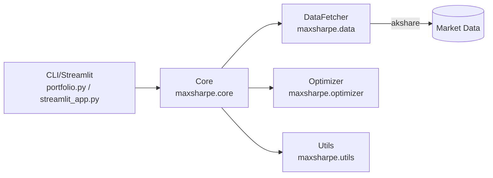

# Max Sharpe Portfolio Optimizer 📈

[](https://www.python.org/)
[](https://opensource.org/licenses/MIT)
[](https://github.com/psf/black)
[](http://makeapullrequest.com)
[](https://github.com/henrywen98/investment_portfolio_optimizer/actions/workflows/ci.yml)

A Python tool to download stock closing prices and build a Max Sharpe Ratio portfolio. Currently supports the China A-share market (CN) only.

> Disclaimer: For educational and research purposes only. Not investment advice.

## Features

- Trading day alignment: automatically matches the Shanghai Stock Exchange (XSHG) calendar
- Data source: A-share adjusted close via akshare
- Portfolio optimization: Max Sharpe using PyPortfolioOpt with max weight constraint
- Outputs: price data, weights, and performance metrics (CSV/JSON)
- Friendly interfaces: both CLI and Python API
- Data validation: automatic cleaning and validation of missing or invalid values

## Quick Start

### Requirements

- Python 3.8+
- pip or conda

### Installation

```bash
git clone https://github.com/henrywen98/investment_portfolio_optimizer.git
cd investment_portfolio_optimizer
python -m venv .venv && source .venv/bin/activate  # Windows: .venv\Scripts\activate
pip install -r requirements.txt
pip install -e .  # optional: install CLI entry 'maxsharpe'
```

### CLI Usage

Use default CN tickers, last 5 years, max single-asset weight 25%, output to `./data`:

```bash
python portfolio.py \\
  --market CN \\
  --years 5 \\
  --rf 0.01696 \\
  --max-weight 0.25 \\
  --output ./data
```

With the installed entry point (after `pip install -e .`):

```bash
maxsharpe --market CN --years 5 --rf 0.01696 --max-weight 0.25 --output ./data
```

Custom tickers (example with 3 stocks):

```bash
python portfolio.py --market CN --tickers "600519,000858,601318" --years 3
```

### Python API

```python
from maxsharpe.core import PortfolioOptimizer

optimizer = PortfolioOptimizer(market="CN", risk_free_rate=0.02, max_weight=0.25)
weights, performance = optimizer.optimize_portfolio(
    tickers=["600519", "000858", "601318"],
    years=3,
)

print("Weights:", weights)
print("Performance:", performance)  # includes expected_annual_return / annual_volatility / sharpe_ratio
```

### Streamlit UI

```bash
streamlit run streamlit_app.py
```

### Docker (optional)

```bash
docker build -t maxsharpe:latest .
docker run --rm -v "$PWD/data:/app/data" maxsharpe:latest python portfolio.py --market CN --years 5 --output /app/data
```

## CLI Arguments

| Arg | Description | Default | Example |
|-----|-------------|---------|---------|
| `--market` | Market (CN only) | `CN` | `--market CN` |
| `--tickers` | Comma-separated stock list | Default pool | `--tickers "600519,000858"` |
| `--years` | Lookback years (mutually exclusive with `--start-date/--end-date`) | `5` | `--years 3` |
| `--start-date` | Start date (YYYY-MM-DD) | Auto | `--start-date 2020-01-01` |
| `--end-date` | End date (YYYY-MM-DD) | Today | `--end-date 2023-12-31` |
| `--rf` | Annual risk-free rate | `0.02` | `--rf 0.015` |
| `--max-weight` | Max weight per asset | `1.0` | `--max-weight 0.3` |
| `--output` | Output directory | `./data` | `--output /path/to/output` |
| `--quiet` | Reduce logging | `False` | `--quiet` |

## Outputs

Generated under the `--output` directory:

| File | Pattern | Content |
|------|---------|---------|
| Prices | `stock_data_<start>_<end>.csv` | Historical adjusted close (aligned) |
| Weights | `weights_<start>_<end>.csv` | Max Sharpe portfolio non-zero weights |
| Performance | `performance_<start>_<end>.json` | Annual return/volatility, Sharpe, max drawdown, etc. |

## Technical Notes

- Data: [akshare](https://akshare.akfamily.xyz/) for China A-share prices
- Calendar: Shanghai Stock Exchange (XSHG) via pandas-market-calendars
- Optimizer: PyPortfolioOpt Max Sharpe with configurable max weight

### Architecture



## FAQ

- ImportError: missing dependencies
  - Install `akshare`, `pandas-market-calendars`, `PyPortfolioOpt` using `pip install -r requirements.txt`
- Empty or very short price data
  - Check ticker codes, extend the date window, or try different tickers
- "No valid trading days found"
  - Ensure the date range includes trading days; the app aligns to valid exchange days

## Contributing

Contributions are welcome! See [CONTRIBUTING.md](CONTRIBUTING.md).

### Local dev quickstart (optional)

```bash
pip install -r requirements.txt
pip install -e .[dev]
black . && isort . && flake8 .
pytest -q
```

## License

MIT License. See [LICENSE](LICENSE).

## Support

- Questions & suggestions: open an Issue
- If you find this useful, please leave a Star ⭐

### Examples

See `examples/` for runnable scripts:

```bash
python examples/basic_usage.py
python examples/custom_portfolio.py --tickers 600519,000858,601318 --years 3 --rf 0.02 --max-weight 0.25
python examples/visualization.py --tickers 600519,000858,601318 --years 3
```
